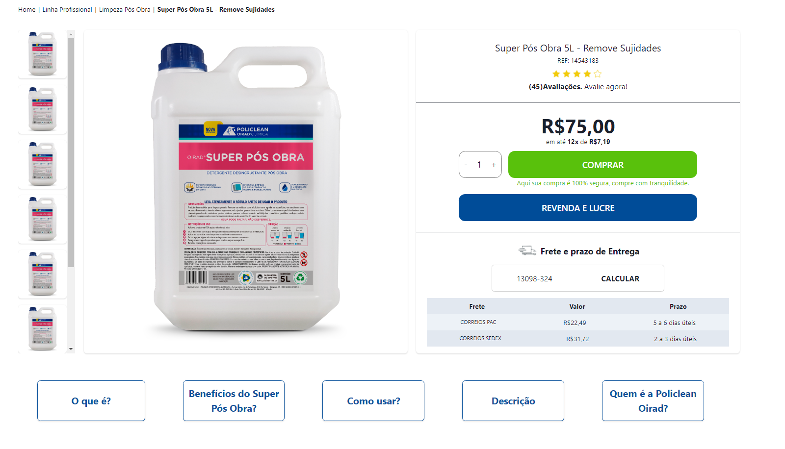

# **Desafio NeoApp**

O Teste de Desenvolvimento consiste em desenvolver uma página de produtos para um dos clientes da empresa. As tecnologias utilizadas foram, React.js, Chakra-UI, Styled-Components, React Router Dom.

## 🔍**Índice**
* [Funcionalidades do projeto](#-funcionalidades-do-projeto)
* [Layout](#-layout)
* [Demonstração](#-demonstração)
* [Como rodar esse projeto?](#-como-rodar-esse-projeto?)
* [Tecnologias utilizadas](#-tecnologias-utilizadas)
* [Pessoas autoras](#-pessoas-autoras)


## 💻 **Funcionalidades do Projeto**
- [x] Landing Page
- [x] Layout Responsivo


## 🖼 **Layout**


## 🎯 **Demonstração**
[Link demonstração](https://desafio-neoapp.vercel.app/)

## 🕹 **Como rodar esse projeto?**

```
# Clone esse repositório
$ git clone link-repositório

# Acesse a pasta do projeto no seu terminal
$ cd teste-dev

# Instale as dependências
$ npm install

# Execute a aplicação
$ npm run dev
```


## ⚙️ **Tecnologias Utilizadas**

1. [React](https://pt-br.reactjs.org/)
2. [Chakra-UI](https://chakra-ui.com/getting-started)
3. [Styled-Components](https://styled-components.com/)
4. [React Router Dom](https://reactrouter.com/en/main)

## 👩🏻‍💻 **Pessoas autoras**

<p>Bruno Maschietto Simões Cruz</p>

[LinkedIn](https://www.linkedin.com/in/bruno-maschietto/)
